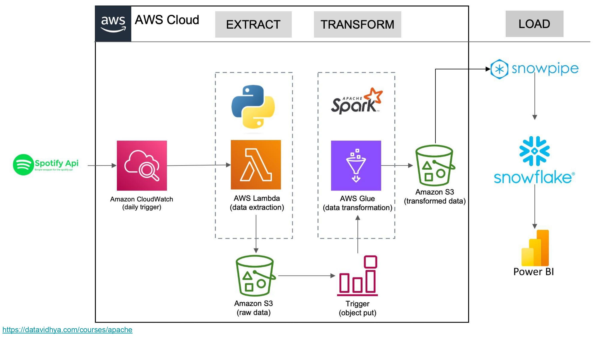
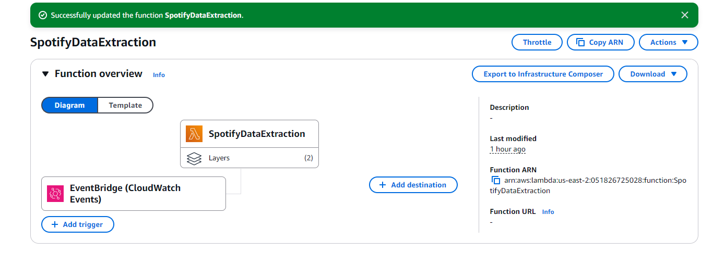

# Spotify ETL Pipeline

This project presents a sophisticated ETL pipeline architecture specifically designed to ingest, transform, and load Spotify playlist data into a Snowflake database for comprehensive analysis and visualization.
The pipeline capitalizes on a synergistic integration of AWS services, Snowflake, and Power BI to automate the intricate processes of data handling.
By leveraging Apache Spark within the transformation phase, the pipeline achieves an unparalleled capacity for handling large-scale data with efficiency and scalability.
This methodological approach ensures high performance and adaptability to complex data structures, making it an exemplary model for data engineering workflows.
---

## Workflow Description

### 1. Data Extraction: AWS Lambda
A Spotify API is used to extract raw playlist data in JSON format. The connection is established using SpotifyClientCredentials, where client credentials (Client ID and Secret) are securely stored in the Lambda environment variables.

**Key Features of `lambda_extraction_function.py`:**
1. Retrieves playlist details using the Spotify API.
2. Saves the raw JSON data into an Amazon S3 bucket.
3. Triggers an AWS Glue Job to process the extracted data.

This function is triggered every midnight using Amazon CloudWatch.

---

### 2. Data Transformation: AWS Glue

The transformation process is implemented in the spark_transformation.py script using PySpark with Glue Context.
Spark is a suitable choice for this transformation process due to its ability to handle large-scale data efficiently and perform distributed computing, which makes it ideal for processing and transforming extensive JSON data structures.

**Steps Performed:**
1. **Raw Data Processing**: The script processes the raw JSON data to extract details about albums, artists, and songs.
2. **Custom Functions**:
   - `process_album`: Extracts `album_id`, `album_name`, `release_date`, `total_tracks`, and `album_url`.
   - `process_artists`: Extracts `artist_id`, `artist_name`, and `artist_url`.
   - `process_songs`: Extracts `song_name`, `song_id`, `duration_ms`, `song_url`, `popularity`, and links with corresponding albums and artists.
3. **Transformations**:
   - Flattening nested JSON structures using explode, which simplifies the processing of complex JSON structures, making the transformation efficient and scalable.
   - Formatting the `added_at` field to a standard DATE format.
4. **Output**: Transformed data is saved back into S3 under `transformed_data/` in separate folders (album, artists, songs) as CSV files.

---

### 3. Data Loading: Snowflake

A Snowflake SQL script (`snowflake.sql`) creates a database (`spotify_db`) with tables for albums (`tbl_album`), artists (`tbl_artists`), and songs (`tbl_songs`).

**Snowpipe Integration:**
1. An S3 bucket  is integrated with Snowflake using Storage Integration (`s3_init`).
2. A Snowpipe is configured to ingest transformed data automatically into the Snowflake tables.

---

### 4. Data Visualization: Power BI

The Snowflake tables are connected to Power BI, where detailed visualizations are created.

These visualizations provide valuable insights into Spotify data trends.

---

## Key Features

- **Automation**: Entire pipeline (ETL) is automated with triggers from CloudWatch and Snowpipe.
- **Scalability**: Using AWS Lambda and Glue allows handling large volumes of Spotify data efficiently.
- **Real-time Data Updates**: Snowpipe enables near-real-time updates of data in Snowflake.
- **Customizable Transformations**: Transformation logic is adaptable to different data structures or additional requirements.

---

## Resources

- **AWS Lambda Function Code**: `lambda_function.py`
- **AWS Glue Transformation Code**: `spark_transformation.py`
- **Snowflake SQL Script**: `snowflake.sql`
- **Data Visualizations**

---

## Tools Used

- **Spotify API**
- **AWS Lambda**
- **Amazon CloudWatch**
- **Amazon S3**
- **AWS Glue**
- **PySpark**
- **Snowflake**
- **Snowpipe**
- **SQL**
- **Power BI**
- **Python**
- **JSON**
- **CSV**
- **AWS IAM Roles**
- **AWS Storage Integration**

---

